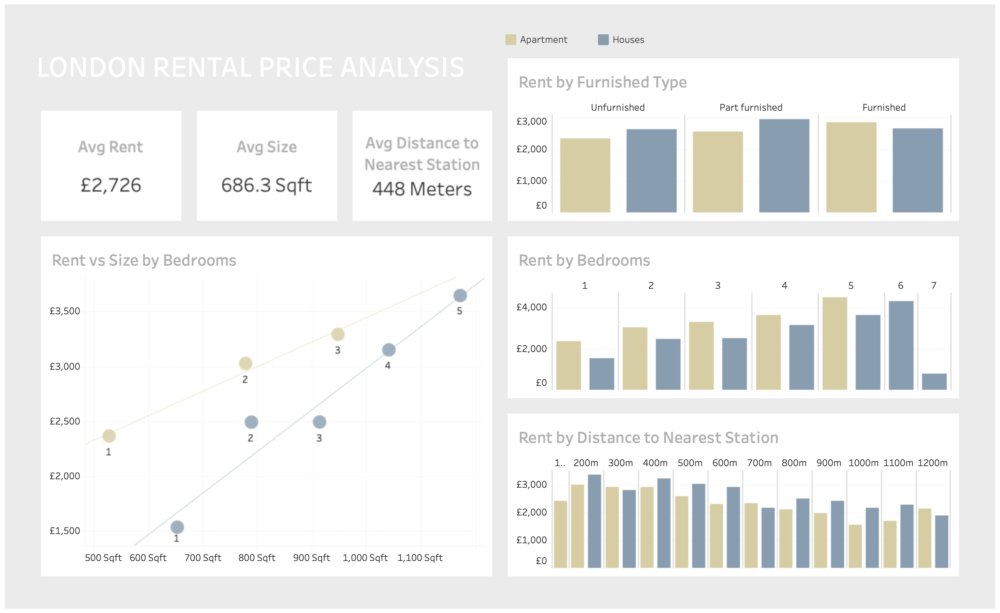

# London Rental Market Analysis

## Context
This project analyzes rental listings in London to understand what drives monthly rent. It is designed as a portfolio piece that highlights clear, recruiter-friendly insights from exploratory data analysis.

## Data source
- Dataset: `rent_ads_rightmove_extended.csv` downloaded from Kaggle (https://www.kaggle.com/datasets/psgpyc/london-property-rental/data)
- Origin: Rightmove rental listings (extended extract)
- Location in repo: `data/raw/rent_ads_rightmove_extended.csv`

## Goal
Answer the question: "What drives rental prices in London — property size, number of bedrooms, furnishing, or transport accessibility?"

## Approach
- Use mean-based summaries after removing high-end outliers.
- Avoid dropping rows globally; filter only where needed for each analysis.
- Keep visuals simple and professional.
- Focus on practical insights rather than academic modeling.

## Key processing choices
- Rent outliers removed for downstream analysis using an IQR rule (above ~5,800 GBP).
- Excluded non-comparable property types from the main analysis:
  - Parking, Garages, Mobile Home, House Share, Flat Share, House of Multiple Occupation, Land
- Grouped remaining property types into two buckets:
  - Apartment vs Houses
- Size outliers removed above 1,250 sq ft for the size-vs-rent visual to keep scale readable.
- Furnishing chart restricted to: Unfurnished, Furnished, Part furnished (other labels are ambiguous).
- Bedroom chart excludes 7-bed listings due to very small counts.
- Transport analysis uses discrete distance values after removing distance outliers.

## What’s in the notebook
Notebook: `notebooks/london_rental_price_analysis.ipynb`

Sections:
1. Rent distribution
2. Property characteristics vs rent
3. Transport accessibility vs rent
4. Key takeaways
5. Tableau-ready dataset export

## Main insights
- Rent is heavily right-skewed; mean-based insights are shown after trimming high-end outliers.
- Bedrooms and size are strong drivers of rent; apartments command higher rents than houses at the same bedroom count.
- Furnishing has a modest effect compared with bedrooms and size.
- Rent declines as distance to the nearest station increases beyond ~0.4 km.
- Rent is significantly lower within 100m from a station due to nuisance. Then jump higher from 200m to 400m then declines as distance to the nearest station increases.
- 2 and 3 bedrooms houses have similar rent, 3 bedrooms  houses being even slightly cheaper than 2 bedrooms houses.

## Limitations
- Size is missing for most listings because many ads use “Ask agent.”
- No geospatial or neighborhood-level adjustments beyond station distance.
- Listings are a snapshot; no time-series trends.
- Analysis is descriptive only (with a few deducted evident causal inference not supported by deeper analysis).

## Tableau-ready dataset
A prefiltered dataset is exported for visualization:
- Path: `data/processed/rent_ads_prefiltered.csv`
- Includes the same filtering applied in the notebook.

## Tableau Dashboard – London Rental Market

👉 **[View interactive dashboard on Tableau Public](https://public.tableau.com/views/LondonRentalPrice/LondonRentalPriceAnalysis?:language=en-GB&publish=yes&:sid=&:redirect=auth&:display_count=n&:origin=viz_share_link)**

## Next steps
- Add borough or sub-district analysis to control for location effects.
- Explore rent per square foot to normalize for size.
- As Property value is not available, use a different dataset to perform a property value analysis using the same dimensions
- Include recommendations for investors based on this analysis and a property value analysis.

